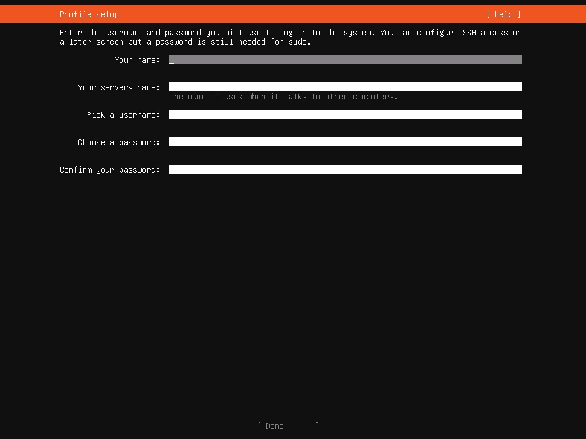
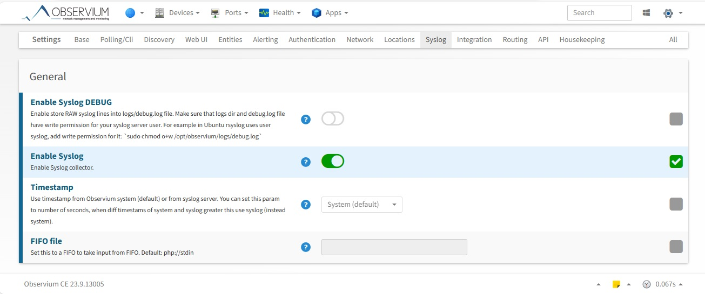
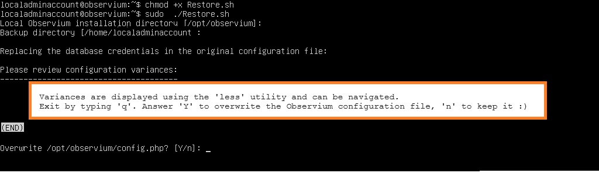
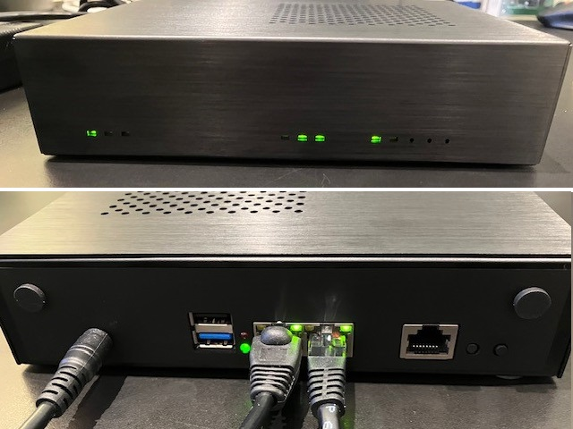
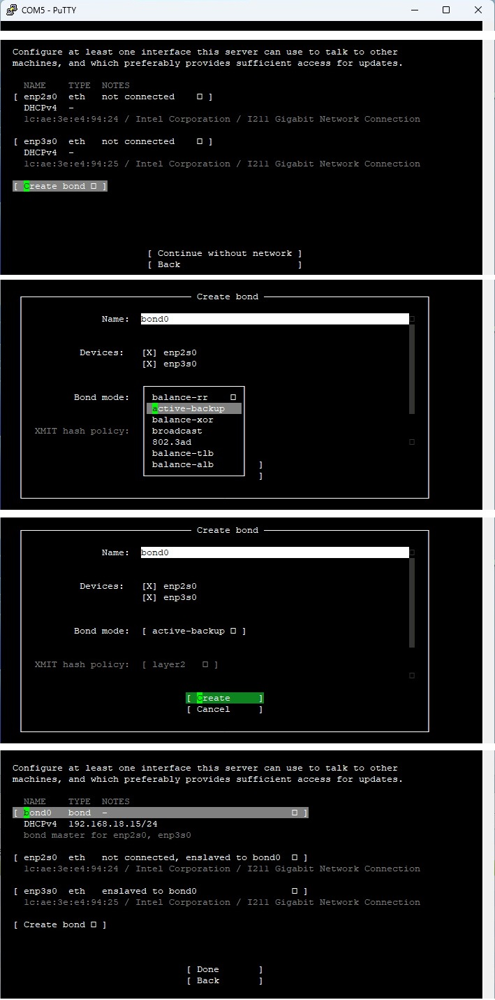

# Building and maintaining an *Observium* appliance

The motivations for this project are:
- demonstrate that the appliance is built from distribution;
- install Let's Encrypt certificates from the DNS API instead of relying on http/https ports.
- integrate a log collector into this appliance

Note: all the scripts in this project should be downloaded in the local system and are presumed to be available at each stage of this implementation.

### This ReadMe is divided in four sections:
- [Build a new observium appliance](#Build-a-new-observium-appliance)
- [Backing up the Observium database](#Backing-up-the-Observium-database)
- [Restoring the Observium installation](#Restoring-the-Observium-installation)
- [Inplace upgrade to the latest Community Edition](#Inplace-upgrade-to-the-latest-Community-Edition)

### Bonus

You can build [a standalone Observium server with fault tolerant network connection](A-standalone-Observium-server-with-fault-tolerant-network-connection).

**Disclaimer:** this project has no relationship with Observium, Ubuntu, and/or Boingfire. All trademarks and copyrights are the property of their respective owners.


# Build a new observium appliance

There are five steps in this workflow and one optional step:
<details><summary>Step 0: Initialize a Linux Server</summary>
It is presumed here that a completely default installation will be done. The following notes are for Ubuntu LTS 22.04.4:

- Review the UEFI "Secure Startup" applicable to your hardware. For example, using Hyper-V's Secure Boot, choose ‘Microsoft UEFI Certificate Authority’ to boot from the distribution medium. YMMV.
- Boot from ISO
- Install Ubuntu Server 22.04 using all the default values such as
- Default Language (English)
- Default keyboard layout (English (US)
- Type of install: Ubuntu Server
- Default network configuration (unless no DHCP server is available on the network): note the IP address of the server.
- No Internet proxy
- Default archive mirror(s)
- Guided storage configuration: use the entire disk (use TABs to get to the [Done] button)
- Storage configuration
- and Confirm destructive action: use TAB to get to the continue button
- fill in the appropriate values in the Profile Setup  and press [Done]

- Skip the "Upgrade to Ubuntu Pro" setup
- Check Install OpenSSH Server, do NOT check Import SSH identity and press [Done]
- Do not install any Featured Server Snaps
- Wait for "Install complete!"
- Press TAB to [Reboot now]
- Wait for "Please remove the installation medium then press ENTER:" message
- If possible, remove the DVD device from the (VM) configuration
- Hit ENTER to initiate the reboot
- and wait until the SSH server is initialized. The last mesage should read "[ OK ] Reached target Cloud-init target."

</details>

<details><summary>Step 1: Update server components</summary>

This script installs the wget utility and updates all components of the server. 

Name resolution is probably not set properly at this point and you should use the server's IP address to login using SSH. You specified the login credentials (UserName and password) in the Profile Setup in Step 0.

Using SCP, copy the script UpdateAll.sh to the user account home directory :

````
scp UpdateAll.sh <UserName@ServerIP>:/home/<UserName>/
````
Using SSH, login the server and type the following commands (there is a large volume of output and it is saved for debugging purposes):
````
sudo -i
script step1.log
chmod +x /home/$SUDO_USER/UpdateAll.sh
/home/$SUDO_USER/UpdateAll.sh
exit	# Exit script
exit	# Exit root
sudo reboot
````

Review the script here: *[Scripts/UpdateAll.sh](https://github.com/SergeCaron/observium_appliance/blob/f7c3afe543a410d8ccf8447607ca682b5df12386/Scripts/UpdateAll.sh)*


</details>

<details><summary>Step 2: Install the Observium software and support components</summary>

This script installs Observium, postfix, and acme.sh: the order is important ;).

The install script for both Observium and acme.sh are downloaded from their respective website at runtime. This is a long running script that will ask for:
- the email address of the user (administrator) registered with *Let's Encrypt*
- Observium installation details:
  - the Observium version you intend to install ("Community Edition" is presumed here)
  - a password for the MySQL *root* administrator. **This password is required to restore a database on this system.**
  - a confirmation to add component 'universe' to all repositories
  - a confirmation to add component 'multiverse' to all repositories
  - a confirmation to install all required libraries
  - the Observium admin user name and password
  - a confirmation to install/configure SNMP daemon and monitor Observium
  - a confirmation to install the UNIX-agent on this server
- Postfix installation details:
  - the mail server configuration type ("Satellite System" was chosen when preparing this list and what follows is probably not complete)
  - the domain name
  - the relayhost ("Satellite System") including port number to send mail to

Upon completion, a simple connectivity test to www.google.com on port 443 should complete with "Verify return code: 0 (ok)".

Using SCP, copy the script InteractiveInstall.sh to the user account home directory :

````
scp InteractiveInstall.sh <UserName@ServerIP>:/home/<UserName>/
````
Using SSH, login the server and type the following commands (again, there is a large volume of output and it is saved for debugging purposes):
````
sudo -i
script step2.log
chmod +x /home/$SUDO_USER/InteractiveInstall.sh
/home/$SUDO_USER/InteractiveInstall.sh
exit	# Exit script
exit	# Exit root
sudo reboot
````
Please be patient... this is a long running install.


Review the script here: *[Scripts/InteractiveInstall.sh](https://github.com/SergeCaron/observium_appliance/blob/f7c3afe543a410d8ccf8447607ca682b5df12386/Scripts/InteractiveInstall.sh)*


Upon reboot, you can access the Observium default web site using (unsecured) HTTP.

Their virtual host declaration is:
````
  <VirtualHost *:80>
    ServerAdmin webmaster@localhost
    DocumentRoot /opt/observium/html
    <FilesMatch \.php$>
      SetHandler application/x-httpd-php
    </FilesMatch>
    <Directory />
            Options FollowSymLinks
            AllowOverride None
    </Directory>
    <Directory /opt/observium/html/>
            DirectoryIndex index.php
            Options Indexes FollowSymLinks MultiViews
            AllowOverride All
            Require all granted
    </Directory>
    ErrorLog  /error.log
    LogLevel warn
    CustomLog  /access.log combined
    ServerSignature On
  </VirtualHost>
````


</details>

<details><summary>Step 3: Install a Let's Encrypt certificate using acme.sh's DNS API</summary>

acme.sh documents their API in *[How to use DNS API](https://github.com/acmesh-official/acme.sh/wiki/dnsapi)*.

DNS settings such as host records (A/AAAA) and Certification Authority Authorization (CAA) records should be properly setup before attempting this step.

This script will install an automatically renewed certificate every 60 days using an API defined by your DNS supplier.

This is a per-DNS service implementation. For example, to issue a certificate using EasyDNS.net, the sequence is:

````
export EASYDNS_Token="xxxxxxxxxxxxxxx.xxxxxxxx"
export EASYDNS_Key="apixxxxxxxxxxxxxx.xxxxxxxx"
.acme.sh/acme.sh --issue --dns dns_easydns -d example.com

````
According to the *acme.sh* wiki, the EASYDNS_Token and EASYDNS_Key will be saved in ~/.acme.sh/account.conf and will be reused when needed. This may be a security risk in your environment.

Your service provider will use different tokens, per their own API. The script defaults to the *Google Cloud DNS API*. The CertificateInstall.sh script requires some editing to supply these secrets. Editing should occur in the home directory of *root* where Let's Encrypt is installed. The script waits for user confirmation before installing the certificate in *apache*'s directory. In case something is wrong, abort the script, edit and retry.

The *apache* virtual host declaration installed by *Observium* is replaced during this operation to allow secure web access. This host declaration reflects the location of the *Let's Encrypt* certificate.

Review this host declaration here: *[Scripts/000-default.conf](https://github.com/SergeCaron/observium_appliance/blob/f7c3afe543a410d8ccf8447607ca682b5df12386/Scripts/000-default.conf)*

Using SCP, copy the script InteractiveInstall.sh and the 000-default.conf file to the user account home directory :

````
scp CertificateInstall.sh <UserName@ServerIP>:/home/<UserName>/
scp 000-default.conf <UserName@ServerIP>:/home/<UserName>/
````
Using SSH, login the server and type the following commands (again, there is a large volume of output and it is saved for debugging purposes):
````
sudo -i
script step3.log
chmod +x /home/$SUDO_USER/CertificateInstall.sh
vi /home/$SUDO_USER/CertificateInstall.sh   # this is a place holder for your favorite editor
/home/$SUDO_USER/CertificateInstall.sh
exit	# Exit script
exit	# Exit root

````
A reboot is not necessary. After you adjust your internal DNS server, the Observium web site is accessible using (secure) HTTPS. Unsecure access will be redirected to the secure virtual host.


Review the script here: *[Scripts/CertificateInstall.sh](https://github.com/SergeCaron/observium_appliance/blob/f7c3afe543a410d8ccf8447607ca682b5df12386/Scripts/CertificateInstall.sh)*


</details>

<details><summary>Step 4: Configure outgoing mail</summary>

This enables a send-only email server, powered by Postfix, with encryption.

This is the sempiternal situation: edit the postfix configuration files to specify the location of the certificate and enable secure transport.

'vi' and 'nano' are installed by default in the Linux distribution used in Step 0 and either can be used to edit /etc/postfix/main.cf and /etc/postfix/master.cf.

The secure protocols are not enabled by default. In /etc/postfix/master.cf, uncomment the lines enabling secure transport (smtps) for this host only. Change
````
# Choose one: enable smtps for loopback clients only, or for any client.
#127.0.0.1:smtps inet n  -       y       -       -       smtpd
#smtps     inet  n       -       y       -       -       smtpd
#  -o syslog_name=postfix/smtps
#  -o smtpd_tls_wrappermode=yes
#  -o smtpd_sasl_auth_enable=yes
#  -o smtpd_reject_unlisted_recipient=no
#  -o smtpd_client_restrictions=$mua_client_restrictions
#  -o smtpd_helo_restrictions=$mua_helo_restrictions
#  -o smtpd_sender_restrictions=$mua_sender_restrictions
#  -o smtpd_recipient_restrictions=
#  -o smtpd_relay_restrictions=permit_sasl_authenticated,reject
#  -o milter_macro_daemon_name=ORIGINATING
````
to:
````
# Choose one: enable smtps for loopback clients only, or for any client.
127.0.0.1:smtps inet n  -       y       -       -       smtpd
#smtps     inet  n       -       y       -       -       smtpd
  -o syslog_name=postfix/smtps
  -o smtpd_tls_wrappermode=yes
  -o smtpd_sasl_auth_enable=yes
  -o smtpd_reject_unlisted_recipient=no
  -o smtpd_client_restrictions=$mua_client_restrictions
  -o smtpd_helo_restrictions=$mua_helo_restrictions
  -o smtpd_sender_restrictions=$mua_sender_restrictions
  -o smtpd_recipient_restrictions=
  -o smtpd_relay_restrictions=permit_sasl_authenticated,reject
  -o milter_macro_daemon_name=ORIGINATING
````
There are several changes needed in /etc/postfix/main.cf.
- this server is its own MTA. Change the line "append_dot_mydomain = no" to "append_dot_mydomain = yes"

- change the "TLS parameters" referring to a "snakeoil" certificate as well as the smtpd security level. Change:
````
smtpd_tls_cert_file=/etc/ssl/certs/ssl-cert-snakeoil.pem
smtpd_tls_key_file=/etc/ssl/private/ssl-cert-snakeoil.key
smtpd_tls_security_level=may
smtp_tls_security_level=may

to read:

smtpd_tls_cert_file=/etc/apache2/certificate/apache-certificate.crt
smtpd_tls_key_file=/etc/apache2/certificate/apache.key
smtpd_tls_CAfile=/etc/apache2/certificate/server-ca.crt
smtpd_tls_security_level=secure
smtp_tls_security_level=secure

````
- and save the file. Use the command "sudo dpkg-reconfigure postfix" to configure other parameters. Otherwise after modifying main.cf, be sure to run 'systemctl reload postfix'. 

Finally, an external email address must be provided to redirect emails to postmaster and to root. This email address is tested once by itself and then redirection is  tested. A third email is sent using the PHP transport thaat is used by default in *Observium*.
These tests are carried out as the Observium user, not root and the emails should appear with the name supplied in Step 0. 
A summary of variances from the default configuration is also printed for review. In case of doubt, *[see this configuration guide](https://wiki.archlinux.org/title/Postfix)*.

Using SCP, copy the script FinalEmailConfiguration.sh to the user account home directory :
````
scp FinalEmailConfiguration.sh <UserName@ServerIP>:/home/<UserName>/
````
Using SSH, login the server and type the following commands. Do not *sudo* the script: we want the mail test to be carried under the Observium user account:
````
script step4.log
chmod +x FinalEmailConfiguration.sh
./FinalEmailConfiguration.sh
exit	# Exit script

````
Review the script here:  *[Scripts/FinalEmailConfiguration.sh](https://github.com/SergeCaron/observium_appliance/blob/f7c3afe543a410d8ccf8447607ca682b5df12386/Scripts/FinalEmailConfiguration.sh)*

The output of the script is:
````
External email address where postmaster's and root's mail is redirected [<email address provided to Let's Encrypt>]:
Creating aliases...
Sending a test message...
Sending a test message from the php transport...
Accepted
-----------------------------------------------------------
After editing, these parameters differ from the default configuration:

postconf: warning: /etc/postfix/master.cf: undefined parameter: mua_sender_restrictions
postconf: warning: /etc/postfix/master.cf: undefined parameter: mua_client_restrictions
postconf: warning: /etc/postfix/master.cf: undefined parameter: mua_helo_restrictions
alias_database = hash:/etc/aliases
alias_maps = hash:/etc/aliases
append_dot_mydomain = yes
biff = no
compatibility_level = 3.6
inet_interfaces = loopback-only
inet_protocols = all
mailbox_size_limit = 0
mydestination = <FQDN of this server>, observium, localhost.localdomain, localhost
myhostname = <FQDN of this server>
mynetworks = 127.0.0.0/8 [::ffff:127.0.0.0]/104 [::1]/128
myorigin = /etc/mailname
readme_directory = no
recipient_delimiter = +
relayhost = <smarthost FQDN and port number provided in Step 2>
smtp_tls_CApath = /etc/ssl/certs
smtp_tls_security_level = secure
smtp_tls_session_cache_database = btree:${data_directory}/smtp_scache
smtpd_banner = $myhostname ESMTP $mail_name (Ubuntu)
smtpd_relay_restrictions = permit_mynetworks permit_sasl_authenticated defer_unauth_destination
smtpd_tls_CAfile = /etc/apache2/certificate/server-ca.crt
smtpd_tls_cert_file = /etc/apache2/certificate/apache-certificate.crt
smtpd_tls_key_file = /etc/apache2/certificate/apache.key
smtpd_tls_security_level = secure

Done!
````

</details>

<details><summary>(Optional) Step 5: Install/configure syslog-ng and verify open ports on this appliance</summary>

Install a log collector: see **[Observium's Syslog Integration](https://docs.observium.org/syslog/)** for a complete description of this feature.

Observium suggested edits (in two groups) are:

**Lines @@ -6,7 +6,16 @@ YMMV**
````
 # First, set some global options.
+# Observium: see https://docs.observium.org/syslog/
+# Make sure these options are set :
+#
+# options {
+#    chain_hostnames(0);
+#    keep_hostname(1);
+#    use_dns(no);
+# };
+
 options { chain_hostnames(off); flush_lines(0); use_dns(no); use_fqdn(no);
          dns_cache(no); owner("root"); group("adm"); perm(0640);
-         stats_freq(0); bad_hostname("^gconfd$");
+         stats_freq(0); bad_hostname("^gconfd$"); keep_hostname(1);
 };
````

**Lines @@ -82,4 +91,18 @@ YMMV**
````
 destination d_ppp { file("/var/log/ppp.log"); };

+# Observium: see https://docs.observium.org/syslog/
+#
+source s_net {
+    udp();
+ };
+
+destination d_observium {
+    program("/opt/observium/syslog.php" template ("$HOST||$FACILITY||$LEVEL_NUM||$LEVEL||$TAG||$YEAR-$MONTH-$DAY $HOUR:$MIN:$SEC||$MSG||$PROGRAM\n") );
+ };
+ log {
+    source(s_net);
+    destination(d_observium);
+ };
+
 ########################
 # Filters
````

Using SSH, login the server and type the following commands:
````
sudo apt install syslog-ng
sudo <your favorite editor> /etc/syslog-ng/syslog-ng.conf  # Insert/Replace the lines marked with +-
sudo service syslog-ng restart
sudo lsof -i -nP
````
The last line verifies open ports on the server. It should look like this:
````
COMMAND    PID              USER   FD   TYPE DEVICE SIZE/OFF NODE NAME
systemd-n  677   systemd-network   18u  IPv4  35292      0t0  UDP <IP>:68
systemd-r  679   systemd-resolve   13u  IPv4  40011      0t0  UDP 127.0.0.53:53
systemd-r  679   systemd-resolve   14u  IPv4  40012      0t0  TCP 127.0.0.53:53 (LISTEN)
snmpd      735       Debian-snmp    6u  IPv4  35549      0t0  UDP 127.0.0.1:161
sshd       789              root    3u  IPv4  35478      0t0  TCP *:22 (LISTEN)
sshd       789              root    4u  IPv6  35480      0t0  TCP *:22 (LISTEN)
mysqld    1448             mysql   32u  IPv4  42220      0t0  TCP 127.0.0.1:33060 (LISTEN)
mysqld    1448             mysql   71u  IPv4  43086      0t0  TCP 127.0.0.1:3306 (LISTEN)
apache2   4379              root    4u  IPv6  49954      0t0  TCP *:80 (LISTEN)
apache2   4379              root    6u  IPv6  49958      0t0  TCP *:443 (LISTEN)
apache2   4380          www-data    4u  IPv6  49954      0t0  TCP *:80 (LISTEN)
apache2   4380          www-data    6u  IPv6  49958      0t0  TCP *:443 (LISTEN)
apache2   4381          www-data    4u  IPv6  49954      0t0  TCP *:80 (LISTEN)
apache2   4381          www-data    6u  IPv6  49958      0t0  TCP *:443 (LISTEN)
apache2   4382          www-data    4u  IPv6  49954      0t0  TCP *:80 (LISTEN)
apache2   4382          www-data    6u  IPv6  49958      0t0  TCP *:443 (LISTEN)
apache2   4383          www-data    4u  IPv6  49954      0t0  TCP *:80 (LISTEN)
apache2   4383          www-data    6u  IPv6  49958      0t0  TCP *:443 (LISTEN)
apache2   4384          www-data    4u  IPv6  49954      0t0  TCP *:80 (LISTEN)
apache2   4384          www-data    6u  IPv6  49958      0t0  TCP *:443 (LISTEN)
xinetd    5462              root    5u  IPv6  52089      0t0  TCP *:36602 (LISTEN)
master    6718              root   13u  IPv4  60885      0t0  TCP 127.0.0.1:25 (LISTEN)
master    6718              root   14u  IPv6  60886      0t0  TCP [::1]:25 (LISTEN)
master    6718              root   18u  IPv4  60890      0t0  TCP 127.0.0.1:465 (LISTEN)
syslog-ng 9192              root   11u  IPv4  82184      0t0  UDP *:514
````


Finally, login your Observium appliance and enable syslog in the *Settings* configuration GUI. 
</details>

# Backing up the Observium database

The objective here is to protect an existing Observium installation in a way compatible with Observium *[Server Migration](https://docs.observium.org/server-migration/)* workflows.

This script creates a backup on a live *remote* Observium system and transfers the contents to the local directory of the caller's system.

In order to reduce the number of times credentials are required to access the remote system, the caller exchange SSH keys.

To mitigate potential incompatibilities, the backup script uses the utilities on the remote system to create the backup files.

In the end, three files will be transfered to the local system in the home directory of the invoking user:
- /opt/observium/config.php
- /opt/observium/observium-dump.sql
- /opt/observium/observium-rrd.tar.gz

According to Observium, that is all that is required to restore the live installation.

Using SCP, copy the script Backup.sh to the user account home directory :
````
scp FinalEmailConfiguration.sh <UserName@ServerIP>:/home/<UserName>/
````
Using SSH, login the local system and invoke the script (privileges are not required on the *local* system):
````
chmod +x Backup.sh
./Backup
````
You will be prompted for:
- the remote Observium installation directory 
- the remote Observium user and server in the form user@<IP Address>
- (only if it does not exists) the details required to create a default public key on the local system: use all default values
- the password of this remote user (twice)

The backup completes and displays the "Press any key to continue..." prompt.

Review the script here:  *[Scripts/Backup.sh](https://github.com/SergeCaron/observium_appliance/blob/f7c3afe543a410d8ccf8447607ca682b5df12386/Scripts/Backup.sh)*

Note: you can create a backup of this appliance by connecting to itself.
<details><summary>Here is a sample log invoked by user localadminaccount:</summary>

````
Remote Observium installation directory [/opt/observium]:
Enter remote Observium user and server in the form user@<IP Address>: localadminaccount@127.0.0.1

Copying the remote Observium server data. The local user password may be required twice:
Generating public/private rsa key pair.
Enter file in which to save the key (/home/localadminaccount/.ssh/id_rsa):
Enter passphrase (empty for no passphrase):
Enter same passphrase again:
Your identification has been saved in /home/localadminaccount/.ssh/id_rsa
Your public key has been saved in /home/localadminaccount/.ssh/id_rsa.pub
The key fingerprint is:
SHA256:qUhXDwILD13YLu0fvC/0Ci1hTRtgGAmED8qzIgYXWts localadminaccount@observium
The key's randomart image is:
+---[RSA 3072]----+
| o=ooB+          |
|o o+=+..         |
|o= +oo. =        |
|+o+ E o= *       |
|..o .o+.S .      |
|oo . +.++        |
|+   . +o.+       |
|       o+ .      |
|        .+.      |
+----[SHA256]-----+
The authenticity of host '127.0.0.1 (127.0.0.1)' can't be established.
ED25519 key fingerprint is SHA256:hIJ7tVGSkocFk0bJH6OO6U8emE1Ilw0o7VHZ37Ist/8.
This key is not known by any other names
Are you sure you want to continue connecting (yes/no/[fingerprint])? yes
Warning: Permanently added '127.0.0.1' (ED25519) to the list of known hosts.
localadminaccount@127.0.0.1's password:
localadminaccount@127.0.0.1's password:
Creating backup files on the source Observium server ...
config.php                                                                            100% 1459     1.4MB/s   00:00
Enter password: ... database dump completed.
 ... rrd data compression completed.

Copying backup files from the remote Observium server ...
observium-rrd.tar.gz                                                                  100%  153KB 137.1MB/s   00:00
observium-dump.sql                                                                    100%  191KB  19.4MB/s   00:00
 ... done!

Press any key to continue...
````

</details>

# Restoring the Observium installation

The objective here is to restore an existing Observium installation in a way compatible with Observium *[Server Migration](https://docs.observium.org/server-migration/)* workflows.

The requirements are:
- a valid Observium installation
- a backup previously saved on the local machine

This is a destructive operation. Current contents of the Observium database and the RRD directory are deleted prior to restoration.

**A word of caution: a new Observium install is not necessarily compatible with the old installation database. For example, I was no longer able to log into a new install that was approximately 1000 revisions apart from the old one (upgrading from Observium CE	22.5.12042 (24th May 2022) to Observium CE	23.9.13005 (16th September 2023)). Make sure you have a backup of the target server in case you need to revert the restore operation.**


This script **must** run as *root*. The script handles the mundane stuff such as adjusting database credentials and name (!) in the configuration file from the backup. The user is then invited to review discrepancies between this file  and the configuration file from the running Observium installation. The user decides to overwrite the configuration file or not. In any case, the credentials and name of the running Observium *mysql* database are used to restore the backup and the file can be edited later on if need be.

Using SSH, login the server and type the following commands (once again, there is a large volume of output and it is saved for debugging purposes):
````
script restore.log
chmod +x Restore.sh
sudo ./Restore.sh
exit	# Exit script
````
Given a user name of *localadminaccount* and a system name of *observium*, the discrepencies are displayed using *less*:  and the confirmation prompt appears on exit.

Quoting directly from *[Observium's Updating page](https://docs.observium.org/updating/#upgrade-to-latest-major-release)*:
- Update DB schema:

````
/opt/observium/discovery.php -u
````

- If it has been a very long time since you've updated (12 months or more), you may want to force an immediate rediscovery of all devices to make sure things are up to date :
````
/opt/observium/discovery.php -h all
````

Review the script here:  *[Scripts/Restore.sh](https://github.com/SergeCaron/observium_appliance/blob/f7c3afe543a410d8ccf8447607ca682b5df12386/Scripts/Restore.sh)*

# Inplace upgrade to the latest Community Edition

This is a direct quote from the *[Observium web site](https://docs.observium.org/updating/)*: "Observium has been designed from its initial inception to be easy and seamless to upgrade. We recommend keeping Community Edition installations updated to the latest version and updating Subscription Edition installations at least once per month."

The Community Edition latest release is documented **[here](https://www.observium.org/)**. According to their documentation, *the Community Edition receives updates and new features on a 12 to 6-monthly release cycle*. You should plan your upgrades accordingly.

The upgrade script:
- ask for confirmation before deleting a previous backup of the software
- downloads the latest Observium Community Edition release
- stops the CRON scheduler
- creates a backup compatible with the *[Restoring the Observium installation](#Restoring-the-Observium-installation)* section above (in case of ...)
- installs the lates edition and upgrades the database schema
- confirm that you want to force an immediate rediscovery of all devices: this is a long running process
- restarts the CRON scheduler


Using SSH, login the server and type the following commands (there is a large volume of output and it is saved for debugging purposes):
````
sudo -i
script upgrade.log
chmod +x /home/$SUDO_USER/Upgrade.sh
/home/$SUDO_USER/Upgrade.sh
exit	# Exit script
exit	# Exit root
````

<details><summary>Here is a sample log:</summary>

````

Local Observium installation directory [/opt/observium]: 
There is a previous backup of the Observium installation in /opt/observium_old.
If you continue, this backup will be removed. Hit ^C to abort ...

--2024-04-18 14:29:53--  https://www.observium.org/observium-community-latest.tar.gz
Resolving www.observium.org (www.observium.org)... 144.76.112.154
Connecting to www.observium.org (www.observium.org)|144.76.112.154|:443... connected.
HTTP request sent, awaiting response... 200 OK
Length: 123667068 (118M) [application/x-gzip]

Saving to: ‘observium-community-latest.tar.gz’

observium-community-latest.ta   0%[                                                  ]       0  --.-KB/s               
observium-community-latest.ta   0%[                                                  ]  24.00K   111KB/s               
[ ... snip ... ]
observium-community-latest.ta  97%[===============================================>  ] 115.45M  17.6MB/s    eta 3s     
observium-community-latest.ta 100%[=================================================>] 117.94M  18.3MB/s    in 20s     

2024-04-18 14:30:13 (5.87 MB/s) - ‘observium-community-latest.tar.gz’ saved [123667068/123667068]


Stopping CRON...
... CRON must be manually restarted if this upgrade is aborted.

Creating backup files on the source Observium server ...
NOTE: the database password is available in plain text in Observium's configuration file.
      You can safely disregard the mysqldump [Warning].
mysqldump: [Warning] Using a password on the command line interface can be insecure.
 ... database dump completed.
tar: rrd/semaine1/ping.rrd: file changed as we read it
tar: rrd/stoic/uptime.rrd: file changed as we read it
 ... rrd data compression completed.

 ... done!

Abort if the backup is not successful ...
/opt ~
observium/
observium/poller-wrapper.py
[ ... snip ... ]
observium/.phpcs.xml
observium/poller.php
~

  ___   _                              _
 / _ \ | |__   ___   ___  _ __ __   __(_) _   _  _ __ ___
| | | || '_ \ / __| / _ \| '__|\ \ / /| || | | || '_ ` _ \
| |_| || |_) |\__ \|  __/| |    \ V / | || |_| || | | | | |
 \___/ |_.__/ |___/ \___||_|     \_/  |_| \__,_||_| |_| |_|
                     Observium Community Edition 23.9.13005
                                  https://www.observium.org
-- Database is up to date.
-- Observium is up to date.

Forcing a rediscovery of all devices is a long process recommended
if it has been a very long time since you've updated.
Force an immediate rediscovery of all devices to make sure things are up to date? [N/y]

Starting CRON...
Done!

````
</details>

Review the script here:  *[Scripts/Upgrade.sh](https://github.com/SergeCaron/observium_appliance/blob/b797c7fb51e2ffa894fdc7da138e8831be0480b6/Scripts/Upgrade.sh)*

# A standalone Observium server with fault tolerant network connection

*Observium*'s hardware requirements are explained in *[Hardware Scaling](https://docs.observium.org/hardware_scaling/)*. The hardware selected here should handle a medium sized network but your mileage may vary.

The Boingfire BFN1K is a headless computer driven by a serial console shown on the right in this picture:.

Boingfire provides the BFFTDICON console cable and recommends using *putty* to configure the BIOS and boot the system.

Ubuntu 22.04 LTS is used to build this particular installation. There are two caveats:
- The Ubuntu Server ISO has no provision to boot from a serial console. A utility to create a USB UEFI bootable key from this ISO is required to be able to edit the bootloader (Grub) configuration. Select a utility that will create a FAT partition on a USB flash drive, transferring the image files to it, and then generating a bootloader to make the partition bootable. Edit the file /boot/grub/grub.cfg and add the following menu entry before the *"Try or Install Ubuntu Server"* menuentry:
````
menuentry "Install Ubuntu Server (Serial)" {
	set gfxpayload=keep
	linux	/casper/vmlinuz   file=/cdrom/preseed/ubuntu-server.seed vga=normal console=tty0 console=ttyS0,115200n8 ---
	initrd	/casper/initrd
}
````

- Bonding of the two network interfaces is done early in the Ubuntu 22.04 LTS installation process. The bonding mode "active-backup" must be selected to obtain a fault-tolerantconfiguration. See the details below:<details><summary>Select Active-Backup configuration></summary> </details>
The Ubuntu 22.04 installer creates a configuration with a missing parameter. According to *[Netplan's YAML Configuration Guide](https://netplan.readthedocs.io/en/latest/netplan-yaml/)*, the default value of the **mii-monitor-interval** parameter is zero, which disables monitoring carrier on each interface. The parameter **MUST** be added to the /etc/netplan/00-installer-config.yaml configuration. Indentation must be respected: this is shown here for the default configuration produced by the installer for this system:
````
# This is the network config written by 'subiquity'
network:
  bonds:
    bond0:
      dhcp4: true
      interfaces:
      - enp2s0
      - enp3s0
      parameters:
        mode: active-backup
        mii-monitor-interval: 100
  ethernets:
    enp2s0: {}
    enp3s0: {}
  version: 2
~
````

The behavior of the bond can be tested before you proceed with the rest of the Observium appliance installation. Care should be taken to assign a static IP to the bond as devices using this appliance will typically be configured to send data to an IP address, not a host name.

The Media Independent Interface (MII) is reported by the bonding driver using the command "cat /proc/net/bonding/bond0". This shows the link status and the active slave:
````
root@observium:~# cat /proc/net/bonding/bond0
Ethernet Channel Bonding Driver: v5.15.0-105-generic

Bonding Mode: fault-tolerance (active-backup)
Primary Slave: None
Currently Active Slave: enp3s0
MII Status: up
MII Polling Interval (ms): 0
Up Delay (ms): 0
Down Delay (ms): 0
Peer Notification Delay (ms): 0

Slave Interface: enp3s0
MII Status: up
Speed: 1000 Mbps
Duplex: full
Link Failure Count: 0
Permanent HW addr: 1c:ae:3e:e4:94:25
Slave queue ID: 0

Slave Interface: enp2s0
MII Status: up
Speed: 1000 Mbps
Duplex: full
Link Failure Count: 0
Permanent HW addr: 1c:ae:3e:e4:94:24
Slave queue ID: 0
root@observium:~#

````
Strangely, the MAC address of the bond is not shown. That is what is presented to each network device connected to this appliance:
````
root@observium:~$ ip link show bond0
4: bond0: <BROADCAST,MULTICAST,MASTER,UP,LOWER_UP> mtu 1500 qdisc noqueue state UP mode DEFAULT group default qlen 1000
    link/ether 26:77:7a:bf:41:e4 brd ff:ff:ff:ff:ff:ff
````
The MAC address of the bonded interface is 26:77:7a:bf:41:e4.
